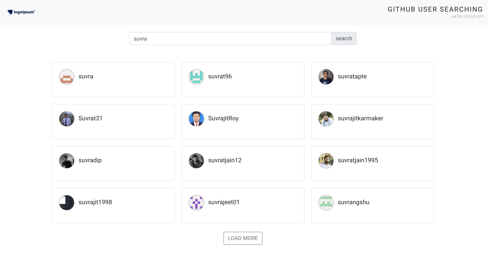

# Github user searching

> via the GitHub API

## Installation

```bash
# install dependencies
npm install

# development
npm run start

# build for production
npm run build
```

### API details

1. https://api.github.com/search/users?q=<query> (where "query" will be an input from the search input)
2. https://api.github.com/users/<username> (where "username" from the user info of the card clicked)Part

### Techstack

-  React.js
-  Bootstrap

#### Few snaps



